# Damage Propagation Modeling for Aircraft Engine Run-to-Failure Simulation

## 1. Problem Definition:
### Prognostics
- prognostics 는 부품의 남은 유효수명(RUL: Remaining Useful Life)을 추정하는 것이다.
  (RUL 은 시간 또는 사이클의 시간 단위로로 표시)
- prognostics 는 시스템 건강 관리(SHM:System Health Management)의 핵심이다.
  남은 수명을 신뢰성 있게 추정하면, 예기치 않은 유지 보수를 피하고 장비 사용을 극대화하는 등
  상당한 비용 절감과 운영 안정성 개선 가능하다.

 

## 2. Data Collection:
- 데이터 기반 예지 측면에서 고장까지(run-to-failure) 도달하는 과정을 담은 데이터 세트가 필요하다.
- 손상 모델링 과정에서 중요한 요구사항은 건강 관련 파라미터의 입력 변화를 허용하고,
  그에 따른 출력 센서 측정값을 기록할 수 있는 적합한 시스템이다. 
- C-MAPSS(Commercial Modular Aero-Propulsion System Simulation)는 이러한 요구사항을 충족한다.

### 2-1. C-MAPSS
- C-MAPSS 는 대형 상업용 터보팬 엔진을 현실적으로 시뮬레이션 할 수 있는 도구이다.
- 사용자가 운영 프로필, 폐루프 제어기, 완경 조건 등에 대한 원하는값을 입력할 수 있도록 여러 입력 파라미터가 존재한다. 
  (C-MAPSS 에는 14의 입력값 존재, 이 논문에서는 폐루프 구성만을 사용)
- Table 1. C-MAPSS 입력값: 시뮬레이션된 엔진의 5개 회전 부품 중 어느 부품에서든 다양한 열화 시나리오를
  시뮬레이션하기 위한 입력값. 예를 들어, HPC 열화를 시뮬레이션하기 위해 HPC 유량 및 효율 수정값 사용  
  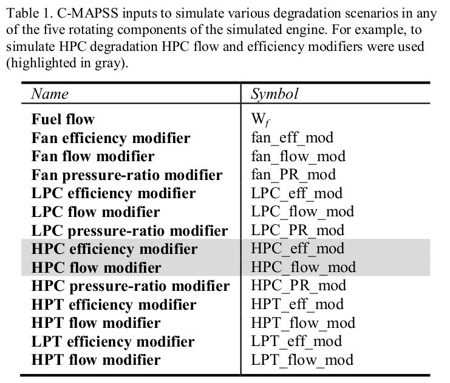  
- Table 2. C-MAPSS 출력은 시스템 응답을 측정하기 위한 것으로 마진은 건강 지수 계산에만 사용되었으며,  
  참가자들에게 명시적으로 제공되지 않았다.  
  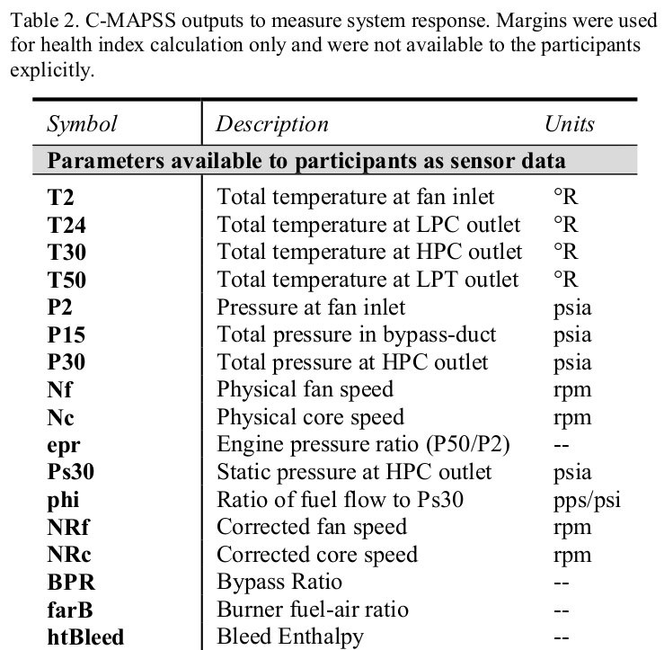  
  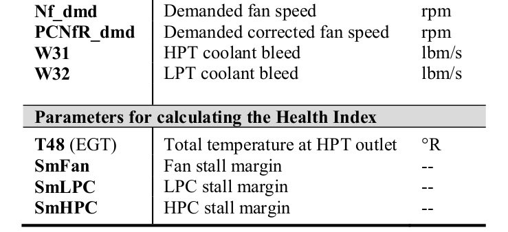  

#### 
- 데이터 세트1과 2는 HPC 의 성능 저하를 갖는다.
- HPC 의 성능 저하는 압축기에서 공기를 충분히 압축하지 못하거나, 효율적으로 압축하지 못하는 현상이다.  
    - 원인: 블레이드 손상 또는 오염, 블레이드 간극 증가, 베어링 문제, 열 변형
    - 증상: 압축 비율 감소, 추력 감소, 연료 효율 저하, 과열 및 손상 위험 증가 

### 2-2. Dataset Description
- 항공기 가스터빈 엔진에서 일반적으로 사용 가능한 센서 측정값에서 얻은 시계열 데이터이다.
- 총 4개의 데이터셋으로 구성되어 있으며, 각 데이터셋은 서로 다른 실험 환경에서 측정되었다.  
    - Traning Engines, Test Engines 는 훈련, 테스트 데이터를 수집한 엔진의 수이다.
    - Fault Modes 는 고장 유형이고, Conditions 는 데이터 생성 시 설정한 조건의 수이다.

#### 2-2-1. train_FD00X.txt
- 예측 모델을 훈련하는 데 사용한다. 훈련 데이터는 엔진의 상태를 시간에 따라서 설명하는 판독값, 운영 변수 및
  기타 관련 특성을 포함한다.
- 훈련 파일에는 RUL 값 또는 고장을 나타내는 지표가 포함되어 있어 모델이 특성과 RUL 간의 관계를 학습할 수 있다.
- train_FD00X 는 고장날 때 까지의 데이터를 포함하고 있다. 따라서 각 엔진의 마지막 사이클의 RUL 값은 0이다.
##### 각 칼럼의 의미
1. unit_number: 엔진의 고유 번호(ID)
2. time_in_cycles: 엔진이 작동한 사이클 수(시간 단위)
3. operational_setting1 ~ 3: 운영 설정값
   (ex: 압축기 관련 변수, 터빈 관련 변수, 연료 관련 변수)
4. sensor_1 ~ 21: 센서 판독값
   (ex: 압력, 온도 등)    
     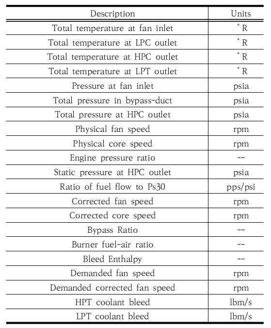
##### 각 사이클 당 한번의 센서 데이터만 제공되는 이유
1. 사이클의 정의와 데이터 수집 방식
- 사이클 기반 데이터 수집: C-MAPSS 데이터셋은 엔진의 작동을 사이클 단위로 나누어 기록한다.
  각 사이클은 엔진이 시작부터 정지까지의 과정을 포함하며, 이 과정에서 특정 시점의 데이터를 기록한다.
- 주기적인 데이터 측정: 엔진의 센서들은 지속적으로 데이터를 수집하지만,
  데이터셋에서는 각 사이클의 특정 시점의 데이터만 기록된다.
  이는 데이터의 양을 줄이고, 특정 사이클의 대표적인 상태를 나타내기 위함이다.

2. 데이터 통합의 필요성
- 데이터 압축 및 요약: 엔진이 작동하는 동안 수집되는 모든 센서 데이터를 기록하면 데이터의 양이 방대해지기 때문에,
  각 사이클의 대표적인 값만 선택하여 기록한다.
  이렇게하면 데이터 분석과 모델링이 더 용이해진다.
- 고정된 측정 시점: 각 사이클마다 설정된 고정된 측정 시점에서의 센서 데이터를 기록함으로써,  
  특정 시점의 엔진 상태를 비교할 수 있는 기준을 제공한다.
  
3. 센서 데이터의 특성
- 다양한 센서: C-MAPSS 데이터셋은 여러 센서로부터 다양한 데이터를 수집한다.
  예를 들어 압력, 온도, RPM, 연료 흐름 등 다양한 센서가 있으며, 이러한 센서들이 주기적으로 데이터를 수집한다.
- 상태 변화 반영: 각 사이클 내에서 센서 데이터는 엔진의 상태 변화에 따라 다르게 측정되며,
  사이클의 시작과 끝에 해당하는 특정 지점에서의 값을 기록하여 엔진 상태를 나타낸다.
  
4. 모델링과 분석의 용이성
- 모델 학습: 각 사이클 당 한 번의 센서 데이터로도 충분히 모델 학습에 필요한 정보를 제공할 수 있다.
  이렇게 하면 모델이 다양한 사이클과 작동 조건을 학습하는 데 필요한 데이터 포인트를 확보할 수 있다.
- 예측 유지보수: 각 사이클의 대표적인 데이터를 통해 엔진의 고장 예측 및 유지보수 전략을 수립할 수 있다.

5. 결론
- C-MAPSS 데이터셋에서 각 사이클당 한 번의 센서 데이터만 기록되는 이유는 데이터 수집의 효율성,
  데이터의 요약 및 특정 시점에서의 엔진 상태를 반영하기 위함이다.
- 이렇게 수집된 데이터는 머신러닝 모델의 학습에 충분한 정보를 제공하며,
  엔진 성능 분석과 고장 예측을 위한 유용한 기초 자료가 된다.

 

## 3. Modeling:
### 3-1. 데이터 로드 
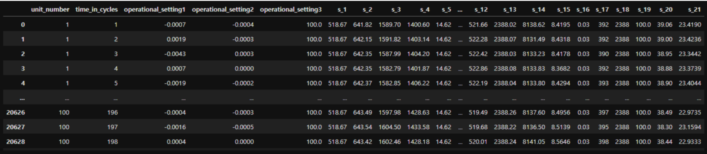
#### RUL 계산 추론 
- time_in_cycles 를 바탕으로 train_FD001 에서 RUL 을 추론할 수 있다.
- 우선 각 엔진의 마지막 사이클을 고장 사이클로 간주하고 각 엔진의 최대 사이클을 추론한다.
- 이후 최대 사이클에서 해당 칼럼의 사이클을 빼면 RUL 을 구할 수 있다.
### 3-2. EDA
#### Data Cleaning
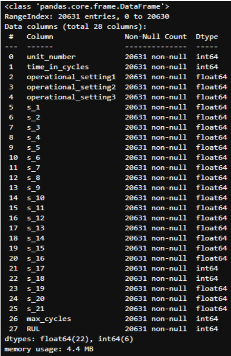
- Heatmap 을 활용하여 상관 계수 확인 및 일정한 독립 변수 제거
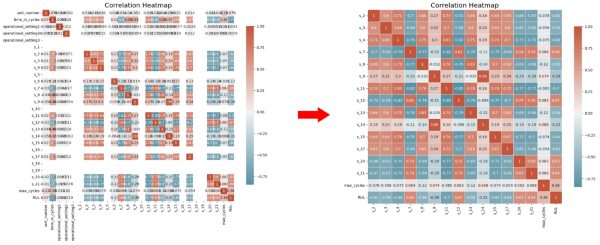

#### Moving Average
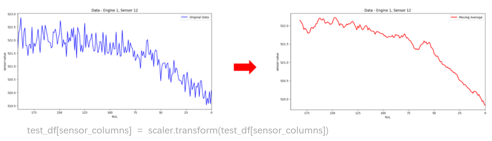

#### Z-Score
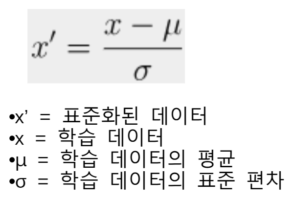

### 3-3. Modeling
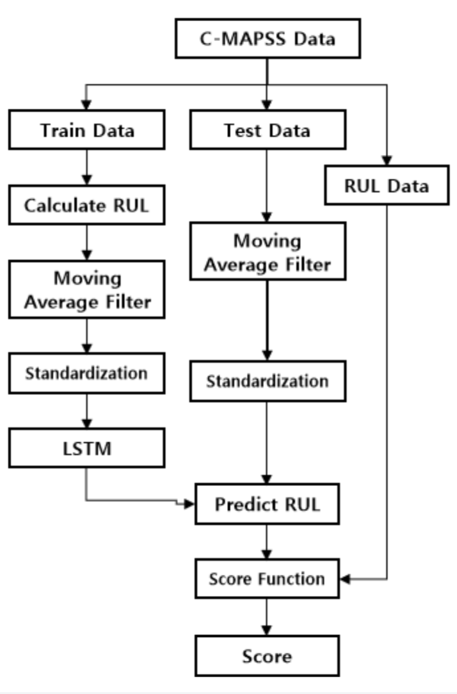

 

## 4. Evaluation: 
### 4-1. Score Function
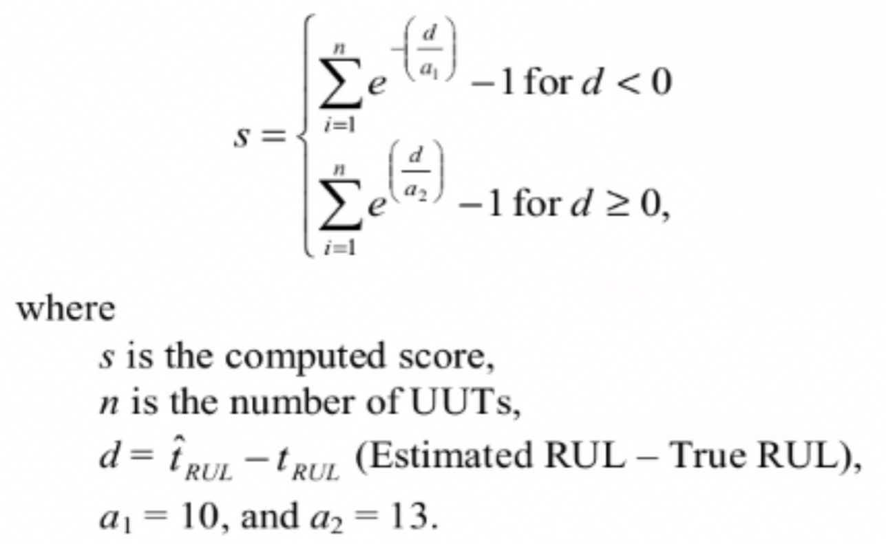
- 회귀분석의 특성상 실제값과 예측값의 차가 적을 수록 정확하므로 점수가 낮을 수록 더 좋은 모델이다.

 

### 4-2. Score
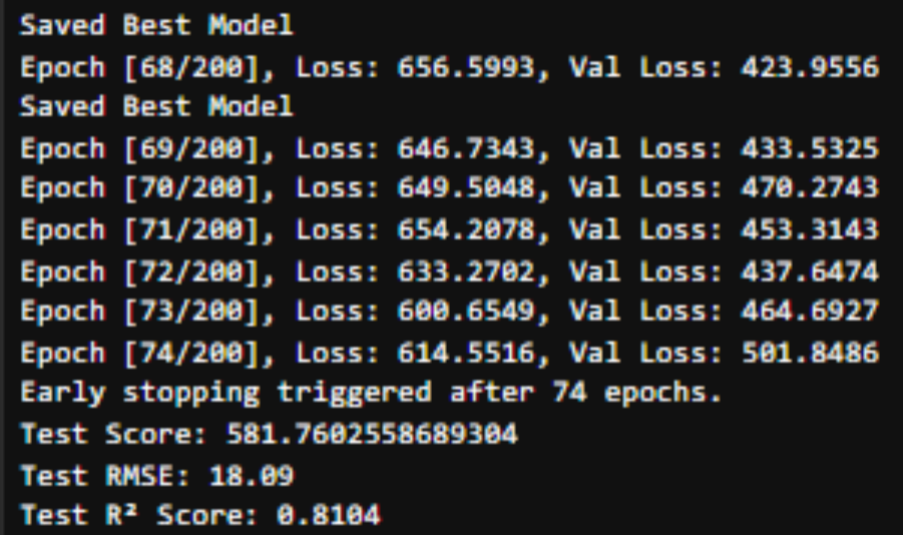
- R2 Score: 0.81
- Score: 581.76

#### 4-3. Evaluation
- 데이터 엔지니어링과 LSTM 모델만으도로 괜찮은 성능을 보였다.
- RUL 130 엔드라인을 설정하고 주성분 분석 후 kNN 으로 예측한 국내모데링 800점 대,  
  CNN 과 SVR 을 활용한 해외 무델이 1000점을 상회하고, 24년 발표한 LSTM-AdaBoost 모델로 예측한 점수가   
  1600점 대인 것을 감안하면 양호한 성능이라고 할 수 있다.
- 하지만 R2 스코어가 초기 가중치에 따라 70~80점으로 불안정하고 과적합 위험도 높아 알고리즘 개선 필요해 보인다.